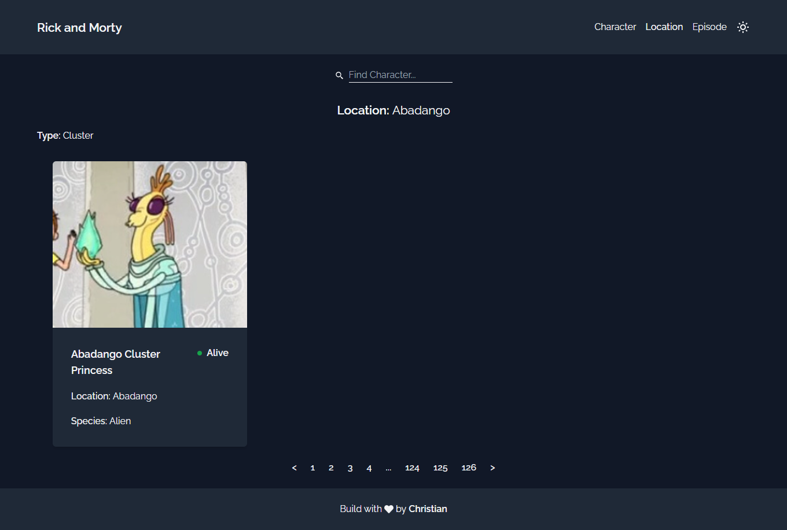
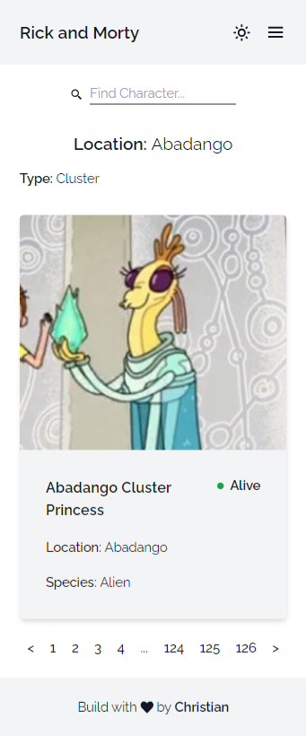

# Rick and Morty

This project was created as a way to showcase my web development skills. The project uses React, designed with TailwindCSS and using the Rick and Morty API.

## Built with

## Dependencies

- [react-paginate](https://www.npmjs.com/package/react-paginate)
- [react-icons](https://www.npmjs.com/package/react-icons)
- [React Router Dom](https://www.npmjs.com/package/reactrouter-dom)

## DevDependencies

- [EsLint](https://www.npmjs.com/package/eslint)
- [Standard](https://www.npmjs.com/package/standard)

## Author

Some of my platforms

- [Frontend Mentor | Christian's profile](https://www.frontendmentor.io/profile/FLCHRIS)
- [GitHub](https://github.com/FLCHRIS)